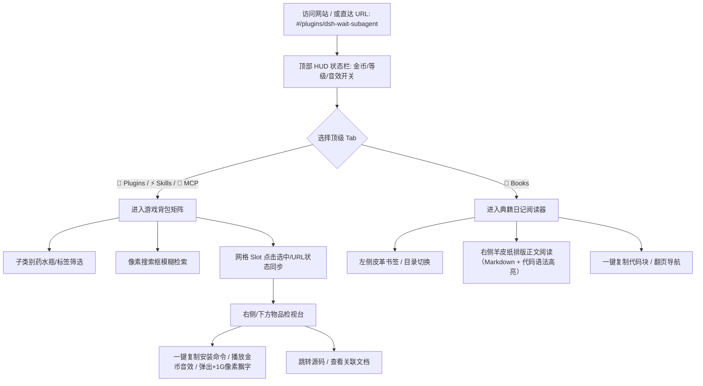

# DSH 资产与经验展示站（DSH Inventory）实施计划

**版本**：v1.1.0 (已通过 expert cross-check 深度修订)  
**计划日期**：2026-09-16  
**对应需求**：开发个人开发的 DSH 插件和使用经验展示网站，模仿游戏（星露谷物语）背包系统与典籍阅读器。

---

## 一、 用户价值与使用路径（User Journey）

### 1.1 核心价值
让访问者以玩 RPG 游戏般的探索乐趣，沉浸式浏览开发者在 DSH、Skills、MCP 及系统架构领域的全套实战资产与避坑秘籍，直观感受技术工匠精神与设计美学。

### 1.2 关键使用路径


1. **路径一：初见探索（First Impression & Ambiance）**
   - 页面载入呈现温暖的星露谷木质大背包界面，URL 状态自动同步；
   - 顶部状态栏呈现玩家信息（“Level 99 DSH Wizard”）、由资产数量折算的游戏金币计数、以及即点即响的 8-bit 音效开关；
   - 鼠标悬停任意格子，出现羊皮纸风味提示框（Pixel Tooltip）与轻柔微音。

2. **路径二：插件与技能深度检视（Item Inspect & Action）**
   - 点击插件格（如 `dsh-wait-subagent`），触发清脆木质咔哒声（带 ADSR 衰减包络），网格显示金黄呼吸选框；
   - 检视台呈现专属像素图标、星级品质（铱星/金星）、功能详述、解决的核心痛点；
   - 点击【一键安装 / 复制】按钮，复制命令到剪贴板，界面跳出绿色 `+1G` 像素浮动金币提示，并伴随欢快的双音阶金币音效；
   - 点击【传送门】直接在新标签页打开源码或关联的本地指引。

3. **路径三：子类别筛选与全局搜索（Filtering & Instant Search）**
   - 点击子类别药水瓶/小标签（如 `Context & Mind` 或 `Engineering`），背包槽位平滑过滤并高亮首个匹配项；
   - 搜索框支持即时检索，若无匹配项展示幽默的“空空如也”复古小插画。

4. **路径四：遗失之书与经验秘籍（Lost Books Experience）**
   - 点击【📖 Books】Tab，背包界面无缝切换为翻开的精装羊皮纸古籍；
   - 左侧为目录与知识难度标识（从初级农夫到巫师级）；
   - 右侧展示深度文章（如孤儿进程排查实录、DSH 远程鉴权解密、容器 Devfs 铁律等），基于原生 Markdown 文件与 Prism/Shiki 风格代码语法高亮。

---

## 二、 架构设计与技术规格（Cross-check 修正版）

### 2.1 技术栈选型
- **构建工具**：Vite 5 (极速构建，对手机 ARM64 环境构建极其友好轻量)
- **前端框架**：React 18 + TypeScript (严格类型保证)
- **路由方案**：轻量 Hash 路由与 URL State 同步（支持直接分享 `#/plugins/dsh-wait-subagent` 或 `#/books/orphan-process-fix`，无需后端重定向，兼容静态托管）
- **Markdown & 代码高亮**：`marked` + `prismjs` 纯净组合
  - 轻量、健壮、不膨胀 bundle，代码块自带复古深色木纹边框和一键复制代码功能。
  - Books 文档作为独立的 `.md` 资源管理，支持 Vite 的 `?raw` 动态按需加载，避免侵入 TS 逻辑。
- **UI & 像素样式系统**：Tailwind CSS + 手工打造的 `pixel-theme.css`
  - **明确澄清**：`pixel-theme.css` 为本项目自建的完整像素设计系统（包含 9-slice 像素木框、凹陷 Slot、羊皮纸浮窗、星露谷复古字体栈）；
  - **DPI 适配与渲染**：对关键图标与边框采用 `image-rendering: pixelated` 与精确整数像素盒阴影体系；
  - **双语字体策略**：西文标题与数字采用经典 `"Press Start 2P"` 像素字体，中文正文采用高清晰度、带微复古质感且在所有设备（包括红米 K30S 手机、桌面 PC）均立即可用的字体栈（`system-ui, "PingFang SC", "Microsoft YaHei", monospace`），确保美观与极致可读性兼得。
- **声音引擎**：原生 Web Audio API 纯代码合成器（8-bit Sound Synthesizer）
  - 零网络开销、零外部静态音频文件加载，离线完全可用；
  - **严格应用 ADSR 包络**（Attack / Decay / Sustain / Release），杜绝裸正弦波/方波的 click/pop 爆音；
  - 包含 5 种定制声效：Slot 悬停微音、Slot 选中木声、Tab 切换滑音、金币收集铃声、书籍翻页沙沙声；
  - 尊重浏览器 Auto-play 策略，用户首次点击界面时自动激活，提供音效静音记忆开关。

### 2.2 数据模型定义（TypeScript Interface）
```typescript
export type ItemCategory = 'plugins' | 'skills' | 'mcp' | 'books';

export type PluginSubCategory = 
  | 'dev-tooling' 
  | 'context-memory' 
  | 'automation-life' 
  | 'integration-web';

export type SkillSubCategory = 
  | 'workflow' 
  | 'engineering' 
  | 'agent' 
  | 'multimodal';

export type QualityLevel = 'normal' | 'silver' | 'gold' | 'iridium';

export interface InventoryItem {
  id: string;
  name: string;
  category: ItemCategory;
  subCategory: string;
  version?: string;
  quality: QualityLevel;
  icon: string; // 像素图标标识
  description: string;
  flavorText: string; // 游戏风味文本（如：“由资深工匠在深夜锻造的利器…”）
  features: string[]; // 核心能力亮点
  installCmd?: string; // 安装/启用命令
  repoUrl?: string; // 仓库或源码链接
  docId?: string; // 关联的 Book 秘籍 ID
  stats: {
    label: string;
    value: string;
  }[];
}

export interface BookEntry {
  id: string;
  title: string;
  subtitle: string;
  level: 'Novice' | 'Artisan' | 'Wizard';
  readTime: string;
  date: string;
  tags: string[];
  summary: string;
  filePath: string; // 指向独立 markdown 源码
}
```

### 2.3 数据源与真实路径对应（已核对）
- **DSH Plugins**（涵盖 `/root/projects/dsh-*` 与 `/root/plugins/*`）：
  - `dsh-wait-subagent`, `dsh-clear-mind`, `dsh-set-model`, `dsh-proactive`, `@xmanrui/dsh-im`, `dsh-anti-addiction`, `dsh-simulated-life`, `dsh-hybrid-notify`, `dsh-stickers`, `dsh-mobile-qol`, `dsh-message-datetime`, `dsh-web-transport-trust`, `dsh-whip`, `dsh-remote-unlock`, `dsh-patch`。
- **Agent Skills**（涵盖 `/root/.agents/skills/*` 真实存在的 40+ 个技能）：
  - 提取其实际 `SKILL.md` 的核心用途与风味定位。
- **MCP Servers**（来自 `/root/.dsh/mcp.json`）：
  - `degoog`, `fetch`, `notebooklm`, `exa`。
- **Books 深度文档**（作为独立的 `.md` 文件编写在 `src/content/books/`）：
  - `01-dsh-plugin-dev-guide.md`
  - `02-orphan-process-cpu-fix.md`
  - `03-chroot-devfs-safety-rules.md`
  - `04-agent-clear-mind-architecture.md`
  - `05-dsh-remote-host-unlock.md`
  - `06-dsh-im-humanlike-gateway.md`

---

## 三、 实施阶段划分与工作分解（WBS）

### 阶段 1：项目脚手架与基础环境搭建
- 初始化 Vite + React + TypeScript 项目；
- 配置 Tailwind CSS 与像素样式系统 `pixel-theme.css`（实现凹凸 Slot、像素边框、调色板）；
- 编写带 ADSR 包络的 Web Audio 像素音效引擎 `src/utils/audio.ts`；
- 安装并配置 `marked` 与代码语法高亮工具。

### 阶段 2：数据中心与 Markdown 典籍构建
- 编写从真实路径提炼的 `src/data/plugins.ts`、`src/data/skills.ts`、`src/data/mcp.ts`；
- 编写 6 篇高质量、干货满满的实战技术长文至 `src/content/books/*.md`；
- 建立统一数据检索与 Hash 路由监听器。

### 阶段 3：游戏背包与物品检视台实现
- 实现 `InventoryGrid` 与凹陷像素 `Slot`（支持品质小星星、选中高亮、悬停 Tooltip）；
- 实现右侧 `ItemInspector` 检视台（大图动效、属性卡片、一键复制代码金币音效反馈与飘字）；
- 实现子类别药水瓶/标签筛选器与全局模糊搜索。

### 阶段 4：典籍与秘籍阅读器（Books 视图）实现
- 实现展开式古卷双页布局（左侧皮革书签目录与难度标识，右侧羊皮纸正文）；
- 嵌入 Markdown 渲染引擎与像素风代码块包装（带行号与一键复制）；
- 支持章节上下翻页与平滑滚动。

### 阶段 5：移动端响应式与体验微调
- 针对手机竖屏（如红米 K30S）优化自适应布局，确保网格与检视台在小屏幕下同样自然美观；
- 添加复古彩蛋（点击金币跳动、空槽位的趣味说明等）。

### 阶段 6：端到端验证与交付
- 启动本地预览服务器并跑通端到端测试；
- 验证所有 4 个大类、所有子分类筛选、搜索、一键复制、音频合成和 Markdown 渲染；
- 产出验证报告，完成交付。

---

## 四、 计划评审与实施准备
本计划已经过 expert 交叉检查，补齐了 Markdown 引擎、字体策略、ADSR 音频包络、真实数据对齐与独立文章管理等关键细节，具备极高的可落地性与最佳体验追求。
下一步向用户汇报计划并请求评审（Align）。
