# 主流 AI Coding Agent Harness 本地会话与 Token 消耗数据采集深度调研报告

**文档标识**：`260927-harness-stats.research.md`  
**调研日期**：2026-09-27  
**研究目标**：查明主流 AI coding agent harness（Claude Code、OpenAI Codex CLI、Cursor、OpenCode、DSH、Amp、Goose、Gemini CLI、Cline / Roo Code、Windsurf、GitHub Copilot CLI、Aider 等）在本地留存的会话记录、Token 消耗、版本号与安装时间等数据，形成可直接用于“星露谷背包风”通用展示站与等级/经验值计算的标准化采集规范。

---

## 1. 调研背景与技术架构概览

在将“星露谷背包风格”装备展示站改版为通用模板时，用户档案（Farmer Profile / Agent Master Profile）需展示：
1. **Harness 版本号**（当前运行环境的版本，相当于“装备品阶/版本”）；
2. **首次安装/启用时间**（决定“从业资历/天数”）；
3. **历史总会话数量**（决定“任务完成数/探险场次”）；
4. **Token 消耗总量**（分输入、输出、缓存读写、推理，决定“魔力消耗 / 经验值 EXP”与等级）。

### 1.1 本地存储形态四大流派

通过对开源生态（`ccusage`、`better-ccusage`、`tokenuse`、`agentgrep`、`ccboard`、`agtop`、`copilot-metrics` 等）和各 Harness 源码/实机的逆向分析，主流 Harness 在本地的持久化呈现四种典型形态：

```mermaid
graph TD
    A[AI Coding Harness 本地数据存储] --> B[流式追加 JSONL]
    A --> C[关系型 SQLite DB / KV]
    A --> D[分层目录 JSON 树]
    A --> E[纯文本 Markdown / 日志]

    B --> B1[Claude Code: ~/.claude/projects/**/*.jsonl]
    B --> B2[Codex CLI: ~/.codex/sessions/**/rollout-*.jsonl]
    B --> B3[Copilot CLI: ~/.copilot/session-state/*/events.jsonl]
    B --> B4[DSH: ~/.dsh/sessions/**/session.v*.jsonl.zstd]
    B --> B5[Gemini CLI 现代版: ~/.gemini/tmp/*/chats/*.jsonl]

    C --> C1[Cursor: state.vscdb cursorDiskKV 表]
    C --> C2[Goose: ~/.local/share/goose/sessions/sessions.db]
    C --> C3[OpenCode v1.14+: opencode.db]
    C --> C4[Windsurf: state.vscdb / trajectory]
    C --> C5[DSH: session-search.db FTS索引]

    D --> D1[OpenCode 历史版: storage/session + message + part]
    D --> D2[Amp: ~/.local/share/amp/threads/T-*.json]
    D --> D3[Gemini CLI 早期版: session-*.json]
    D --> D4[Cline / Roo Code: tasks/*/ui_messages.json]

    E --> E1[Aider: <repo>/.aider.chat.history.md]
```



### 1.2 统计口径核心痛点与避坑准则

1. **累积量（Cumulative）vs 单轮增量（Delta）**：
   - 部分 Harness（如 OpenAI Codex CLI 的 `total_token_usage`、Goose 的 `accumulated_*`）记录的是从会话开始到当前步骤的累积值；若简单将每行数字累加，会导致 Token 统计爆炸放大数十倍。
   - 另一部分 Harness（如 Claude Code 的 assistant message、Amp 的 usageLedger、DSH 的 turn usage）每条记录仅代表当次模型请求的增量消耗。
2. **缓存 Token 的口径差异（Cache Overlap）**：
   - Anthropic（Claude Code）：`input_tokens` **不包含** `cache_read_input_tokens`，两者独立；
   - OpenAI / Gemini / Copilot：`input_tokens` 通常是包含 `cached_tokens` 的毛输入（Gross Input），净未命中缓存输入（Net Prompt Tokens）需要计算：`uncached_input = max(0, input_tokens - cached_tokens)`。
3. **推理/思考 Token（Reasoning Tokens）归属**：
   - OpenAI（o1/o3/gpt-5/gpt-6）、Gemini（thoughts）、DeepSeek（reasoning_content）：大多已打包进 `output_tokens` 计费，单独的 `reasoning_tokens` 字段是细分说明，切忌再次相加以免 double count。
4. **子代理（Subagent）与工作树（Worktree）重复统计**：
   - Claude Code 的 `subagents/` 目录可能挂载在主会话下；
   - OpenCode 支持父子 Session 派生；
   - DSH 记录中子会话拥有 `parentSession` 字段。通用统计需决定是计入总 Token 还是按独立 Session 去重。

---

## 2. 各主流 Harness 本地数据存储与采集规范

---

### 2.1 Claude Code (Anthropic)

Claude Code 是当前代码生成 CLI 中本地数据保存最为系统化的工具之一。

#### 1. 存储位置与跨平台路径
- **默认路径**：
  - Linux / macOS：`~/.claude/projects/` 或 `~/.config/claude/projects/`
  - Windows：`%USERPROFILE%\.claude\projects\` 或 `%APPDATA%\Claude\projects\`
- **子代理路径**：`~/.claude/projects/<project-dir>/subagents/*.jsonl`
- **环境变量覆盖**：`CLAUDE_CONFIG_DIR`（可指定多个，逗号分隔）
- **项目目录命名规则**：由工作区绝对路径转换而来，斜杠被替换为连字符 `-`（如 `-root-projects-my-app`），超长时截断 200 字符加哈希。

#### 2. 文件格式与关键字段结构
文件格式为纯文本 **JSONL**，每一行是一个完整的 JSON 对象，文件名即为 UUID（`0746bf28-45ff-4d23-8f44-592da6a7026d.jsonl`）。
核心关注 `type: "assistant"` 的行（注意同一轮次可能因为工具调用拆分成多行，但携带相同的 `message.id`）：

```json
{
  "type": "assistant",
  "timestamp": "2026-05-15T09:30:00.000Z",
  "sessionId": "0746bf28-45ff-4d23-8f44-592da6a7026d",
  "cwd": "/root/projects/my-app",
  "message": {
    "id": "msg_01ABC...",
    "role": "assistant",
    "model": "claude-sonnet-4-5-20250920",
    "usage": {
      "input_tokens": 1250,
      "output_tokens": 420,
      "cache_creation_input_tokens": 3500,
      "cache_read_input_tokens": 18200,
      "speed": "standard",
      "server_tool_use": { "web_search_requests": 0 }
    }
  }
}
```

此外，Claude Code 自带汇总缓存：`~/.claude/stats-cache.json`，缓存了已扫描的历史数据（`totalSessions`、`dailyModelTokens`、`modelUsage`、`firstSessionDate` 等）。

#### 3. 统计口径
- **会话数**：枚举 `~/.claude/projects/*/*.jsonl` 文件数量（排除 `subagents/` 子目录或将其标记为子任务）。
- **Token 统计**：按 `message.id` 去重。同一 `message.id` 的行只取第一条的 `usage`：
  - `Input Tokens` = `message.usage.input_tokens`
  - `Output Tokens` = `message.usage.output_tokens`
  - `Cache Read Tokens` = `message.usage.cache_read_input_tokens`
  - `Cache Write Tokens` = `message.usage.cache_creation_input_tokens`
  - `Total Tokens` = `input + output + cache_read + cache_write`

#### 4. 版本号与首次安装时间
- **版本号**：
  - 命令行：`claude --version`
  - 包管理器缓存：`npm list -g @anthropic-ai/claude-code --json`
- **首次安装/使用时间**：
  - `~/.claude/stats-cache.json` 中的 `firstSessionDate`
  - 或 `~/.claude` 目录创建时间 / 最早一个 `*.jsonl` 的文件 `mtime` 或 `birthtime`。

#### 5. 社区已有工具
- `ccusage`（Rust / npm `@ccusage/claude`）：原生支持 `ccusage session`、`ccusage daily`。
- `tokenuse`、`agentgrep`、`agent-diary`、`agent-replay`。

---

### 2.2 OpenAI Codex CLI

OpenAI 官方推出的命令行编码 Agent，以 `rollout` 形式组织会话。

#### 1. 存储位置与跨平台路径
- **默认路径**：
  - 环境变量：`${CODEX_HOME:-~/.codex}`
  - Linux / macOS：`~/.codex/sessions/YYYY/MM/DD/`
  - Windows：`%USERPROFILE%\.codex\sessions\YYYY\MM\DD\`
- **索引数据库**：`~/.codex/state_5.sqlite`（或 `state_N.sqlite`）
- **轻量提示词日志**：`~/.codex/history.jsonl`

#### 2. 文件格式与关键字段结构
文件格式为 JSONL，命名规范为：`rollout-YYYY-MM-DDThh-mm-ss-<uuid>.jsonl`。
每行包含 `timestamp`、`type` 与 `payload`：

```json
{
  "timestamp": "2026-07-20T16:44:37.772Z",
  "type": "event_msg",
  "payload": {
    "type": "token_count",
    "info": {
      "total_token_usage": {
        "input_tokens": 15420,
        "cached_input_tokens": 12800,
        "output_tokens": 850,
        "reasoning_output_tokens": 120,
        "total_tokens": 16270
      },
      "last_token_usage": {
        "input_tokens": 3200,
        "cached_input_tokens": 2800,
        "output_tokens": 180,
        "reasoning_output_tokens": 40,
        "total_tokens": 3380
      },
      "model_context_window": 258400
    },
    "rate_limits": {
      "plan_type": "team",
      "primary": { "used_percent": 12.5, "window_minutes": 300, "resets_at": 1776721478 }
    }
  }
}
```

此外，SQLite 索引数据库 `state_5.sqlite` 中存在 `threads` 表：
```sql
CREATE TABLE threads (
    id TEXT PRIMARY KEY,
    rollout_path TEXT NOT NULL,
    created_at INTEGER NOT NULL,
    updated_at INTEGER NOT NULL,
    source TEXT NOT NULL,
    model_provider TEXT NOT NULL,
    cwd TEXT NOT NULL,
    title TEXT NOT NULL
);
```

#### 3. 统计口径
- **会话数**：可直接查询 SQLite `SELECT count(*) FROM threads` 或统计 `sessions/**/*.jsonl` 文件数。
- **Token 统计（特别注意累积陷阱）**：
  - `payload.info.total_token_usage` 是整场会话的**累积总量**。如果只统计会话总消耗，直接读取该会话最后一条 `token_count` 记录的 `total_token_usage`！
  - 如果需要按日/按月拆分，读取 `payload.info.last_token_usage`（单轮增量）进行累计；
  - 净输入 Token：`uncached_input = max(0, input_tokens - cached_input_tokens)`；
  - 推理 Token：`reasoning_output_tokens` 已经内含在 `output_tokens` 中，不可重复相加。

#### 4. 版本号与首次安装时间
- **版本号**：`codex --version`，或查看 `~/.codex/version.json`。
- **首次安装时间**：`~/.codex` 目录的创建时间，或 SQLite 中 `SELECT min(created_at) FROM threads`（Unix 秒级时间戳）。

#### 5. 社区已有工具
- `ccusage codex session --json`、`better-ccusage codex`、`agentgrep`。

---

### 2.3 Cursor (IDE 与 CLI / cursor-agent)

Cursor 基于 VS Code 深度定制，其会话存储经历了从早期工作区 DB 到全局 DB、再到现代 Central Storage 的演进。

#### 1. 存储位置与跨平台路径
Cursor 区分 IDE 界面操作与独立 CLI（`cursor-agent`）：
- **Cursor IDE（桌面客户端）**：
  - macOS：`~/Library/Application Support/Cursor/User/`
  - Linux：`~/.config/Cursor/User/`
  - Windows：`%APPDATA%\Cursor\User\`
  - 数据库分布：
    - 全局数据库：`globalStorage/state.vscdb`（SQLite 格式）
    - 工作区数据库：`workspaceStorage/<workspace-hash>/state.vscdb`
- **Cursor CLI（`cursor-agent`）**：
  - `~/.cursor/projects/<project-hash>/agent-transcripts/**/*.jsonl`
  - `~/.cursor/chats/<workspace-hash>/<chat-uuid>/store.db`（Protobuf + JSON）
  - `~/.cursor/ai-tracking/ai-code-tracking.db`

#### 2. 文件格式与关键字段结构
核心存储介质是 SQLite 文件 `state.vscdb`，核心表为 `cursorDiskKV(key TEXT, value TEXT)`：
- **会话元数据**：`key = 'composerData:<composerId>'`
  - `createdAt`：毫秒时间戳；
  - `usageData`：记录模型使用量与花费（美分）：
    ```json
    "usageData": {
      "claude-4-sonnet-thinking": {
        "costInCents": 96,
        "amount": 32
      }
    }
    ```
  - `fullConversationHeadersOnly`：消息气泡数组 `[{"bubbleId": "...", "type": 1}, ...]`。
- **消息气泡**：`key = 'bubbleId:<composerId>:<bubbleId>'`
  - `type`: `1` 为 user，`2` 为 assistant；
  - `tokenCount`: `{"inputTokens": 120, "outputTokens": 80}`（新版有时为 `{0, 0}` 走全局聚合）；
  - `timingInfo`: 耗时信息。
- **Cursor 3.0+ 集中索引**：`ItemTable` 表中的 `composer.composerHeaders`，记录所有活跃会话及其 `workspaceIdentifier`。

#### 3. 统计口径
- **会话数**：
  ```sql
  SELECT count(*) FROM cursorDiskKV WHERE key LIKE 'composerData:%';
  ```
- **Token 消耗**：
  - 若 `bubbleId` 中存在非零 `tokenCount`，累加 `tokenCount.inputTokens` 与 `outputTokens`；
  - 若 `tokenCount` 为 0，读取 `composerData` 中的 `usageData` 美分成本，或从 `composerData.promptTokenBreakdown.totalUsedTokens` 提取基准；
  - 对于 CLI 模式，直接解析 `~/.cursor/projects/*/agent-transcripts/*.jsonl`。

#### 4. 版本号与首次安装时间
- **版本号**：CLI `cursor --version`，或 IDE 安装目录下的 `package.json`。
- **首次安装时间**：`globalStorage/state.vscdb` 的创建时间，或 `SELECT min(createdAt) FROM ...`。

#### 5. 社区已有工具
- `cursaves`、`cursor-export`、`ccboard`、`agentgrep`、`tokenuse`。

---

### 2.4 OpenCode (opencode.ai)

OpenCode 是支持多模型的终端开源 AI Coding Agent。

#### 1. 存储位置与跨平台路径
- **默认路径**：
  - 环境变量：`${OPENCODE_DATA_DIR:-${XDG_DATA_HOME:-$HOME/.local/share}/opencode}`
  - Windows：`%LOCALAPPDATA%\opencode` 或 `~/.local/share/opencode`
- **存储架构分水岭**：
  - **v1.14 之前**：多文件 JSON 树结构，位于 `storage/session/`、`storage/message/`、`storage/part/`；
  - **v1.14 及之后**：集中式 SQLite 数据库 `~/.local/share/opencode/opencode.db`（采用 Drizzle ORM 管理）。

#### 2. 文件格式与关键字段结构
- **现代架构（SQLite: `opencode.db`）**：
  - 表 `session`：`id`, `title`, `project_id`, `directory`, `time_created`, `time_updated`；
  - 表 `message`：`id`, `session_id`, `time_created`, `data` (JSON)；
  - 表 `part`：`id`, `message_id`, `session_id`, `data` (JSON 内容与工具调用)。
  
  其中 `message.data` 包含完整的 Token 统计：
  ```json
  {
    "role": "assistant",
    "modelID": "claude-sonnet-4.6",
    "providerID": "github-copilot",
    "cost": 0,
    "tokens": {
      "total": 11540,
      "input": 11387,
      "output": 153,
      "reasoning": 0,
      "cache": { "read": 8192, "write": 1024 }
    }
  }
  ```

- **历史架构（JSON 目录树）**：
  - `storage/session/{projectHash}/{sessionID}.json`：元数据及 `time.created`、`time.updated`；
  - `storage/message/{sessionID}/msg_{messageID}.json`：同上 JSON 结构。

#### 3. 统计口径
- **会话数**：
  - SQLite：`SELECT count(*) FROM session;`
  - 文件：枚举 `storage/session/*/*.json` 数量。
- **Token 统计**：
  - 遍历所有 `message` 记录（`role == "assistant"`），按单轮累加 `tokens.input`、`tokens.output`、`tokens.cache.read`、`tokens.cache.write`、`tokens.reasoning`。

#### 4. 版本号与首次安装时间
- **版本号**：`opencode --version`。
- **首次安装时间**：`~/.local/share/opencode` 目录创建时间，或 SQLite 中 `SELECT min(time_created) FROM session`。

#### 5. 社区已有工具
- `ccusage opencode`、`better-ccusage opencode`、`Claude-Code-Workflow (ccw)`。

---

### 2.5 DSH (DeepSeek Harness)

DSH 是自研/宿主深度融合的高并发多 Agent 框架（即当前运行环境）。

#### 1. 存储位置与跨平台路径
- **默认主目录**：`~/.dsh/`
- **会话存储根目录**：`~/.dsh/sessions/`
- **项目目录映射**：`~/.dsh/sessions/--<normalized-cwd>--/<session-uuid>/`
  - 例如当前项目在 `/root/projects/my-dsh-inventory`，对应路径为：  
    `~/.dsh/sessions/--root-projects-my-dsh-inventory--/<session-id>/`
- **日志压缩与代际文件**：
  - 当前代规范产物：`session.v3.jsonl.zstd`（Zstandard 压缩的 JSONL）
  - 历史代兼容产物：`session.v2.jsonl.zstd`、`session.v1.jsonl.zstd` 或未压缩的 `session.vN.jsonl`
- **全文检索与状态索引**：`~/.dsh/session-search.db`（SQLite FTS5）

#### 2. 文件格式与关键字段结构
`session.v3.jsonl.zstd` 解压后每一行代表一个持久化事件：
1. **Header 行（首行）**：
   ```json
   {
     "type": "session",
     "version": 3,
     "id": "3fb954ed-12ed-4e65-89cb-affa89d6b8a5",
     "createdAt": 1790488232878,
     "cwd": "/root/projects/my-dsh-inventory",
     "parentSession": "session-2cbda792-bf3b-4f65-925f-90bc16c1af6c",
     "origin": "subagent",
     "agentPreset": "standard"
   }
   ```
2. **助手轮次用量行（`type: "assistant/message"`）**：
   ```json
   {
     "type": "assistant/message",
     "seq": 23,
     "time": 1790488249580,
     "data": {
       "turn": 1,
       "step": 2,
       "message": { "role": "assistant", "id": "...", "source": { "provider": "cpa", "model": "medium" } },
       "usage": {
         "inputTokens": 6008,
         "outputTokens": 305,
         "totalTokens": 26585,
         "cacheReadTokens": 20272,
         "cacheWriteTokens": 0
       }
     }
   }
   ```

#### 3. 统计口径
- **会话数**：
  - 扫描 `~/.dsh/sessions/*/*/` 目录，统计包含 `session.*.jsonl*` 的子目录总数；
  - 可区分根会话与子代理（检查 Header 行中是否有 `parentSession` 或 `origin == "subagent"`）。
- **Token 统计**：
  - 解压读取所有 `session.v*.jsonl.zstd`，累加 `type == "assistant/message"` 的 `data.usage`：
    - `Input Tokens` = `data.usage.inputTokens`
    - `Output Tokens` = `data.usage.outputTokens`
    - `Cache Read` = `data.usage.cacheReadTokens || 0`
    - `Cache Write` = `data.usage.cacheWriteTokens || 0`
    - `Total Tokens` = `data.usage.totalTokens`

#### 4. 版本号与首次安装时间
- **版本号**：读取 `/usr/lib/node_modules/@deepseek-ai/dsh/package.json` 中的 `version` 字段（如 `0.1.5-rc.3`）。
- **首次安装时间**：`stat -c %W ~/.dsh` 或扫描 `~/.dsh/sessions/` 中所有会话 Header 的最小 `createdAt`。

---

### 2.6 Goose (Block / AAIF)

Goose 由 Block 开源，其架构在 v1.10.0 完成向 SQLite 的全面迁移，并且是少数**原生存储 USD 消耗**的 Agent。

#### 1. 存储位置与跨平台路径
- **默认路径**：
  - Linux：`~/.local/share/goose/sessions/sessions.db`（旧版兼容 `~/.local/share/Block/goose/sessions/`）
  - macOS：`~/Library/Application Support/Block/goose/sessions/sessions.db`
  - Windows：`%APPDATA%\Block\goose\data\sessions\sessions.db`
  - 环境变量覆盖：`GOOSE_PATH_ROOT`

#### 2. 文件格式与关键字段结构
SQLite 数据库 `sessions.db`，核心表 `sessions`：
```sql
CREATE TABLE sessions (
    id TEXT PRIMARY KEY,                       -- 如 20250310_1
    name TEXT NOT NULL DEFAULT '',
    working_dir TEXT NOT NULL,
    created_at TIMESTAMP DEFAULT CURRENT_TIMESTAMP,
    updated_at TIMESTAMP DEFAULT CURRENT_TIMESTAMP,
    -- 单轮当次用量
    total_tokens INTEGER,
    input_tokens INTEGER,
    output_tokens INTEGER,
    -- 累积全量用量 (Accumulated)
    accumulated_total_tokens INTEGER,
    accumulated_input_tokens INTEGER,
    accumulated_output_tokens INTEGER,
    accumulated_cache_read_tokens INTEGER,
    accumulated_cache_write_tokens INTEGER,
    accumulated_cost REAL,                     -- 原生记录的 USD 金额！
    provider_name TEXT,                        -- 如 "anthropic", "openai"
    model_config_json TEXT                     -- 包含 {"model_name": "..."}
);
```

#### 3. 统计口径
Goose 的数据提取最为简单、鲁棒：
```sql
SELECT 
    count(*) as session_count,
    min(created_at) as first_install,
    sum(coalesce(accumulated_input_tokens, input_tokens, 0)) as total_input,
    sum(coalesce(accumulated_output_tokens, output_tokens, 0)) as total_output,
    sum(coalesce(accumulated_cache_read_tokens, 0)) as total_cache_read,
    sum(coalesce(accumulated_total_tokens, total_tokens, 0)) as total_tokens,
    sum(coalesce(accumulated_cost, 0.0)) as total_cost_usd
FROM sessions;
```

#### 4. 版本号与首次安装时间
- **版本号**：`goose --version`。
- **首次安装时间**：`SELECT min(created_at) FROM sessions`。

#### 5. 社区已有工具
- `openusage`、`ccusage goose`。

---

### 2.7 Amp (Sourcegraph / Anthropic)

Amp 是具备独特 Credit（积分）计费体系与使用账本（Usage Ledger）的 Agent。

#### 1. 存储位置与跨平台路径
- **默认路径**：
  - Linux / macOS：`${AMP_DATA_DIR:-~/.local/share/amp}/threads/`
  - Windows：`%LOCALAPPDATA%\amp\threads\`
- **文件命名**：`T-{uuid}.json`

#### 2. 文件格式与关键字段结构
单会话单一 JSON 文件，包含两级统计：
```json
{
  "id": "T-abc12345-6789",
  "created": 1740000000000,
  "title": "Refactor auth middleware",
  "messages": [
    {
      "id": "msg-1",
      "role": "assistant",
      "usage": {
        "inputTokens": 100,
        "outputTokens": 50,
        "cacheCreationInputTokens": 500,
        "cacheReadInputTokens": 200,
        "credits": 0.05
      }
    }
  ],
  "usageLedger": {
    "events": [
      {
        "messageId": "msg-1",
        "model": "claude-haiku-4-5-20251001",
        "inputTokens": 100,
        "outputTokens": 50,
        "totalTokens": 150,
        "credits": 0.05,
        "createdAt": "2026-03-01T10:00:00Z"
      }
    ]
  }
}
```

#### 3. 统计口径
- **会话数**：枚举 `~/.local/share/amp/threads/T-*.json` 文件数量。
- **Token 与积分统计**：
  - 优先读取 `usageLedger.events`；
  - 缓存详情通过 `messageId` 关联到 `messages[].usage` 中的 `cacheCreationInputTokens` 与 `cacheReadInputTokens`；
  - 累加 `inputTokens`、`outputTokens`、`credits`。

#### 4. 版本号与首次安装时间
- **版本号**：`amp --version`。
- **首次安装时间**：最早一个 `T-*.json` 的 `created` 字段或文件创建时间。

#### 5. 社区已有工具
- `ccusage amp session`、`budi`、`tku`。

---

### 2.8 Gemini CLI (Google)

#### 1. 存储位置与跨平台路径
- **默认路径**：
  - 环境变量：`${GEMINI_DATA_DIR:-~/.gemini/tmp}`
  - Linux / macOS：`~/.gemini/tmp/<project_hash>/chats/`
  - Windows：`%USERPROFILE%\.gemini\tmp\<project_hash>\chats\`
- **凭据与全局配置**：`~/.gemini/settings.json`、`~/.gemini/installation_id`

#### 2. 文件格式与演进
- **早期/导出格式**：单一文件 `session-*.json`（包含 `messages` 数组）；
- **现代格式（v0.45+）**：分块或行分隔 **JSONL**，保存在 `chats/<session-uuid>/*.jsonl` 或 `session-*.jsonl`：
  - 第一行为 Session 元数据；
  - 后续行记录每个 step 的模型返回及 `tokens` 块：
  ```json
  {
    "id": "turn-1",
    "timestamp": "2026-05-01T18:34:40.000Z",
    "type": "gemini",
    "model": "gemini-2.5-pro",
    "tokens": {
      "input": 120,
      "output": 30,
      "cached": 20,
      "thoughts": 15,
      "tool": 5,
      "total": 170
    }
  }
  ```

#### 3. 统计口径
- **会话数**：递归扫描 `~/.gemini/tmp/*/chats/` 下的独立 Session 文件/目录。
- **Token 归一化**：
  - `uncached_input = max(0, tokens.input - tokens.cached)`
  - `cache_read = tokens.cached`
  - `output = tokens.output + tokens.tool + tokens.thoughts`
  - `reasoning = tokens.thoughts`

#### 4. 版本号与首次安装时间
- **版本号**：`gemini --version`。
- **首次安装时间**：`~/.gemini/installation_id` 文件的创建时间，或最早会话文件的 `mtime`。

---

### 2.9 Cline 与 Roo Code (VS Code 体系 Agent 插件)

Cline（原 Claude Dev）和其知名分叉 Roo Code 是 VS Code 扩展生态中最主流的自主 Agent。

#### 1. 存储位置与跨平台路径
- **VS Code 全局存储目录**：
  - **Cline**：
    - Linux：`~/.config/Code/User/globalStorage/saoudrizwan.claude-dev/`
    - macOS：`~/Library/Application Support/Code/User/globalStorage/saoudrizwan.claude-dev/`
    - Windows：`%APPDATA%\Code\User\globalStorage\saoudrizwan.claude-dev\`
    - 现代独立 CLI / SDK 存储：`~/.cline/data/`
  - **Roo Code**：
    - Linux：`~/.config/Code/User/globalStorage/rooveterinaryinc.roo-cline/`
    - macOS：`~/Library/Application Support/Code/User/globalStorage/rooveterinaryinc.roo-cline/`
    - Windows：`%APPDATA%\Code\User\globalStorage\rooveterinaryinc.roo-cline\`

#### 2. 文件格式与关键字段结构
每个 Task（会话）拥有独立目录 `tasks/<taskId>/`：
- `tasks/<taskId>/ui_messages.json`（早期叫 `claude_messages.json`）
- `tasks/<taskId>/api_conversation_history.json`
- **总索引（最关键、最快速）**：
  - 位于扩展的 `state/taskHistory.json`（或 `globalState.vscdb` 中的 `taskHistory` 键）。
  - 数据结构为一个 `HistoryItem[]` 数组：
  ```json
  [
    {
      "id": "7dd300cc-6205-47ab-913e-fc921e68cef9",
      "ts": 1741761045123,
      "task": "Fix database connection leak in auth service",
      "tokensIn": 45210,
      "tokensOut": 3200,
      "cacheWrites": 1200,
      "cacheReads": 154000,
      "totalCost": 0.485,
      "size": 34500,
      "modelId": "claude-3-7-sonnet-20250219"
    }
  ]
  ```

#### 3. 统计口径
无需遍历大文件，直接读取 `state/taskHistory.json`：
- `总会话数` = `taskHistory.length`
- `总输入 Token` = `sum(item.tokensIn)`
- `总输出 Token` = `sum(item.tokensOut)`
- `总缓存读取` = `sum(item.cacheReads)`
- `总原生费用` = `sum(item.totalCost)`

#### 4. 版本号与首次安装时间
- **版本号**：VS Code extensions 目录（`~/.vscode/extensions/saoudrizwan.claude-dev-*/package.json`）。
- **首次安装时间**：`taskHistory[0].ts`（最早一个 task 的创建时间戳）。

---

### 2.10 Windsurf (Codeium)

Codeium 开发的 AI 原生 IDE，内置 Cascade 代理引擎。

#### 1. 存储位置与格式特性
- **存储路径**：
  - macOS：`~/Library/Application Support/Windsurf/User/globalStorage/state.vscdb`
  - Linux：`~/.config/Windsurf/User/globalStorage/state.vscdb`
  - 工作区 DB：`workspaceStorage/<workspace-hash>/state.vscdb`
  - 本地轨迹与模型缓存：`~/.codeium/windsurf/cascade/`
- **加密与私有性注意（极重要）**：
  - 社区逆向（Issue #127, #136）显示：`~/.codeium/windsurf/cascade/*.pb` 文件采用基于 UUID 的 AES 加密，外部无法直接反序列化；
  - 活跃会话与近期未清理的对话以 JSON/Protobuf 文本缓存在 `globalStorage/state.vscdb` 的 `ItemTable` 中（键名包含 `cascade.chatdata` 或 `cursorDiskKV` 兼容键）；
  - Windsurf 默认有 20~50 个会话的自动清理策略，超出会被截断。

#### 2. 统计口径
- **会话数**：查询 `state.vscdb` 中 `key LIKE '%cascade%'` 或扫描 `~/.codeium/windsurf/cascade/` 文件数。
- **Token 用量**：Windsurf 采用本地语言服务器 RPC + 服务端扣减 Flex Credits，本地不留存详尽历史 Token 流，仅能在内存/活动 Trajectory 中抓取。因此在展示站中建议标注为“按会话数统计”或通过 Codeium 个人页 API 补充。

---

### 2.11 GitHub Copilot CLI 与 VS Code Copilot Chat

#### 1. 存储位置与跨平台路径
- **CLI 模式**：
  - 环境变量：`${COPILOT_HOME:-~/.copilot}`
  - 会话状态目录：`~/.copilot/session-state/<session-id>/events.jsonl`
  - 2026 年现代中央数据库：`~/.copilot/session-store.db` 与 `data.db`
  - 可选 OTel 日志：`~/.copilot/otel/*.jsonl`
- **VS Code 插件模式**：
  - VS Code workspaceStorage 下的 `chatSessions/<session-id>.jsonl`
  - 遥测跨度数据库：`agent-traces.db`

#### 2. 关键结构与统计口径
在 `~/.copilot/session-state/<session-id>/events.jsonl` 中，会话结束时会写入权威性的 `session.shutdown` 事件：
```json
{
  "type": "session.shutdown",
  "data": {
    "shutdownType": "routine",
    "totalPremiumRequests": 1,
    "modelMetrics": {
      "gpt-5.4": {
        "requests": { "count": 5, "cost": 1 },
        "usage": {
          "inputTokens": 244120,
          "outputTokens": 2383,
          "cacheReadTokens": 202112,
          "cacheWriteTokens": 0
        }
      }
    }
  }
}
```
- **统计口径**：
  - 会话数：`~/.copilot/session-state/*/` 目录数；
  - 净输入 Token：`inputTokens - cacheReadTokens - cacheWriteTokens`；
  - 输出与缓存直接读取 `outputTokens`、`cacheReadTokens`；
  - 自 2026 年 6 月起，GitHub 启用 AI Credits，`session.compaction_complete` 中带有 `totalNanoAiu` 字段（每 10⁹ 为 1 积分）。

---

### 2.12 Aider (Pure Markdown / File-based)

Aider 坚持无数据库、轻量级、与 Git 紧密贴合的哲学。

#### 1. 存储位置
- **存储路径**：保存在每次运行的工作目录（git root）中：
  - `<cwd>/.aider.chat.history.md`
  - `<cwd>/.aider.input.history`
- **全局回退路径**：`~/.aider.chat.history.md`（若设置了 `AIDER_CHAT_HISTORY_FILE`）

#### 2. 文件格式与统计特征
- 格式为纯 **Markdown**。每次会话以一级标题启动：
  ```markdown
  # 2026-04-29 12:34:56.789 UTC
  > user prompt text

  Assistant response...
  ```
- **局限性**：Aider **不会在磁盘 Markdown 中写入每轮的 Token 计数与费用**！Aider 仅在运行内存中依据当前上下文计算。
- **采集方案**：
  - **会话数**：统计 Markdown 中 `# YYYY-MM-DD` 标题出现的次数；
  - **Token 估计**：工具（如 `agtop`）采用字符估算法则：`tokens ≈ text_characters / 4.0`；或者使用轻量级本地分词器对历史 user/assistant block 进行快速估算。

---

### 2.13 其它小众/新兴 Harness 存储速查

| Harness 名称 | 本地存储路径 | 文件格式 | 核心统计字段与口径 |
|---|---|---|---|
| **Factory Droid** | `~/.factory/sessions/` | JSONL | 每轮记录包含 prompt / completion tokens |
| **ZCode (Zai)** | `~/.zcode/cli/db/db.sqlite` | SQLite | 表内直接维护 session 列表与 token_usage |
| **Pi-agent / OMP** | `~/.pi/agent/sessions/` | JSONL (v3) | Header `{"type":"session","version":3}`，每轮带 usage |
| **Kimi CLI** | `~/.kimi/` 或 `~/.kimi-code/` | JSON / JSONL | 按会话目录存储，带模型与 token 记录 |
| **Qwen CLI** | `~/.qwen/` | JSONL | 兼容 OpenAI 事件格式，带 usage 字段 |
| **Devin CLI** | `~/.local/share/devin/cli/` | ATIF + `sessions.db` | SQLite 存储会话元数据，ATIF 格式存储完整轨迹 |

---

## 3. 全 Harness 指标横向对比与采集矩阵

下表总结各 Harness 在本地留下的可采集指标情况与可靠度评级：

| Harness | 存储引擎 | 会话数可靠度 | Token 细分粒度 (输入/输出/缓存/推理) | 原生费用/积分 | 版本号获取途径 | 首次安装/使用时间 | 社区采集工具 |
|---|---|---|---|---|---|---|---|
| **Claude Code** | JSONL (`~/.claude/projects/`) | ⭐⭐⭐⭐⭐ (极高，文件数) | 输入、输出、缓存读、缓存写（完全精确） | 可由模型推算 (自带 stats-cache) | `claude -v` / package.json | `stats-cache.json` 首条或目录创建 | `ccusage`, `tokenuse`, `agentgrep` |
| **Codex CLI** | JSONL + SQLite (`~/.codex/`) | ⭐⭐⭐⭐⭐ (极高，SQLite/文件) | 输入、输出、缓存读、推理（精确，需注意累积口径） | 记录 rate_limits 档位与 API 相当 | `codex -v` / `version.json` | SQLite `min(created_at)` | `ccusage`, `better-ccusage` |
| **Cursor** | SQLite (`state.vscdb`) | ⭐⭐⭐⭐⭐ (极高，`composerData`) | 输入、输出（新版多为 session 级聚合） | `usageData` 含美分 `costInCents` | `cursor -v` / 软件目录 | `min(createdAt)` 毫秒戳 | `cursaves`, `ccboard`, `tokenuse` |
| **OpenCode** | SQLite (`opencode.db`) / JSON | ⭐⭐⭐⭐⭐ (极高，表行数) | 输入、输出、缓存读写、推理（完全精确） | 记录 provider 与 cost 字段 | `opencode -v` | SQLite `min(time_created)` | `ccusage`, `better-ccusage`, `ccw` |
| **DSH** | JSONL.ZSTD (`~/.dsh/sessions/`) | ⭐⭐⭐⭐⭐ (极高，目录数) | 输入、输出、缓存读写、总数（完全精确） | 按 provider/model 结合计费 | package.json / settings | 目录 ctime / Session 最小 createdAt | 内置 `dsh-token-meter`, `session-search` |
| **Goose** | SQLite (`sessions.db`) | ⭐⭐⭐⭐⭐ (极高，表行数) | 具备单轮与 Accumulated 累积全量字段 | **原生存储 `accumulated_cost` (USD)** | `goose -v` | SQLite `min(created_at)` | `openusage`, `ccusage` |
| **Amp** | JSON (`~/.local/share/amp/`) | ⭐⭐⭐⭐⭐ (极高，文件数) | 输入、输出、缓存读写（通过 messageId 关联） | **原生存储 `credits` 消耗** | `amp -v` | 最小 `created` 毫秒戳 | `ccusage`, `budi`, `tku` |
| **Gemini CLI** | JSONL / JSON (`~/.gemini/tmp/`) | ⭐⭐⭐⭐ (高，多文件) | 输入、输出、cached、thoughts(推理)、tool | 需根据模型推算 (自带配额接口) | `gemini -v` | `installation_id` 创建时间 | `ccusage`, `tokenmeter` |
| **Cline / Roo** | JSON (`state/taskHistory.json`) | ⭐⭐⭐⭐⭐ (极高，单文件全量) | tokensIn, tokensOut, cacheReads, cacheWrites | **原生存储 `totalCost` (USD)** | 扩展 package.json | `taskHistory[0].ts` | 原生内置 History |
| **Windsurf** | SQLite (`state.vscdb`) | ⭐⭐⭐ (中，保留近 20~50 轮) | 轨迹被 AES 加密，仅活动缓存有部分明文 | 服务端扣减 Flex Credits | IDE package.json | 目录创建时间 | `windsurf-trajectory-extractor` |
| **Copilot CLI** | JSONL (`session-state/*/`) | ⭐⭐⭐⭐⭐ (极高，shutdown 行) | input, output, cacheRead, cacheWrite, reasoning | 记录 nano_aiu 与 premium 计数 | `copilot -v` | 目录创建时间 | `ccusage`, `copilot-metrics` |
| **Aider** | Markdown (`.aider.chat.history.md`) | ⭐⭐⭐⭐ (高，标题数) | 磁盘无 Token 记录，仅能按字符/分词估算 | 无 | `aider -v` | Markdown 首个日期标题 | `agtop`, `deja-vu` |

---

## 4. 星露谷装备展示站等级与经验值（EXP）计算体系设计

在星露谷背包风格的展示站中，需把用户本地提取出的 Harness 数据转化为生动、符合游戏感官的“农场主 / 代码冒险家档案”：

### 4.1 核心经验值计算公式推荐

为了平衡轻度用户、长时间重度用户以及缓存命中率高的用户，推荐采用**加权经验值公式（Weighted EXP Formula）**：

$$\text{EXP} = (\text{Sessions} \times 50) + \left(\frac{\text{Output Tokens}}{100}\right) + \left(\frac{\text{Input Uncached Tokens}}{1000}\right) + \left(\frac{\text{Cache Read Tokens}}{5000}\right) + \left(\frac{\text{Reasoning Tokens}}{500}\right)$$

**设计权衡**：
1. **Sessions（会话场次）赋予基础点数**（每次对话相当于一次“下矿探险”或“完成日常委托”）；
2. **Output Tokens（模型生成输出）权重最高**（因为生成代码直接代表了工作成果与高计算成本，每 100 token = 1 点经验）；
3. **Cache Read Tokens（缓存命中）给予适度奖励**（表彰用户的良好上下文复用习惯与低成本效率）；
4. **Reasoning Tokens 介于输入输出之间**（代表高强度思考深度）。

### 4.2 星露谷等级映射阶梯

采用星露谷物语经典的技能等级（Level 0 ~ Level 10，以及 10 级后的“精通/Mastery”星级）：

| 等级 | 称号 (Title) | 所需累积 EXP | 典型装备/外观映射 |
|---|---|---|---|
| **Lv 0** | 新手学徒 (Greenhorn) | 0 | 破旧的生锈铁镐 / 默认布衣 |
| **Lv 1** | 脚本小工 (Script Taker) | 500 | 木质手杖 / 铜矿原石 |
| **Lv 2** | 补丁匠人 (Patch Smith) | 1,500 | 铜镐 / 简易工具包 |
| **Lv 3** | 重构学者 (Refactor Scholar) | 3,500 | 铜剑 / 农场工装 |
| **Lv 4** | 终端潜行者 (Terminal Scout) | 7,000 | 铁镐 / 探险者皮靴 |
| **Lv 5** | 管道法师 (Pipeline Mage) | 12,000 | 铁剑 / 精致怀表 (解锁专业技能) |
| **Lv 6** | 架构骑士 (Architecture Knight)| 20,000 | 金镐 / 坚硬指环 |
| **Lv 7** | 自动化领主 (Automation Baron) | 32,000 | 金剑 / 航海家风衣 |
| **Lv 8** | 智能体驯兽师 (Agent Master) | 50,000 | 铱金镐 / 魔法水晶 |
| **Lv 9** | 提示词先知 (Prompt Oracle) | 75,000 | 铱金战斧 / 纯金饰品 |
| **Lv 10** | 极客至尊 (Silicon Deity) | 110,000 | 银河之剑 (Galaxy Sword) / 铱金王冠 |
| **Mastery**| 虚空漫步者 (Void Stalker) | 200,000+ | 纯紫虚空像素披风 + 动态星空光晕 |

---

## 5. 跨平台开箱即用数据采集脚本规范（采集实现代码）

为了让任何 fork 仓库的用户能在自己本地“一键扫码”出自己的 Harness 档案，提供一个自包含的跨平台采集脚本实现（Node.js / ESM 编写，零重依赖，直接使用 Node 内置模块与可选 SQLite）：

```typescript
// scripts/harvest-harness-stats.mjs
import fs from 'node:fs';
import path from 'node:path';
import os from 'node:os';
import { execSync } from 'node:child_process';
import zlib from 'node:zlib';

const HOME = os.homedir();

export interface HarnessProfile {
  name: string;
  detected: boolean;
  version?: string;
  firstInstallDate?: string;
  totalSessions: number;
  tokens: {
    input: number;
    output: number;
    cacheRead: number;
    cacheWrite: number;
    reasoning: number;
    total: number;
  };
  totalCostUsd?: number;
  nativeCredits?: number;
}

// 1. 扫描 Claude Code
export function harvestClaudeCode(): HarnessProfile {
  const profile: HarnessProfile = {
    name: 'Claude Code',
    detected: false,
    totalSessions: 0,
    tokens: { input: 0, output: 0, cacheRead: 0, cacheWrite: 0, reasoning: 0, total: 0 }
  };

  const claudeDir = process.env.CLAUDE_CONFIG_DIR || path.join(HOME, '.claude');
  const projectsDir = path.join(claudeDir, 'projects');

  if (!fs.existsSync(claudeDir)) return profile;
  profile.detected = true;

  // 版本探测
  try {
    profile.version = execSync('claude --version', { stdio: ['ignore', 'pipe', 'ignore'] }).toString().trim();
  } catch {
    profile.version = 'installed';
  }

  // 首创日期
  const statsCacheFile = path.join(claudeDir, 'stats-cache.json');
  if (fs.existsSync(statsCacheFile)) {
    try {
      const stats = JSON.parse(fs.readFileSync(statsCacheFile, 'utf8'));
      if (stats.firstSessionDate) profile.firstInstallDate = stats.firstSessionDate;
    } catch {}
  }
  if (!profile.firstInstallDate) {
    profile.firstInstallDate = fs.statSync(claudeDir).birthtime.toISOString();
  }

  // 扫描 JSONL 收集 Token
  if (fs.existsSync(projectsDir)) {
    const projectDirs = fs.readdirSync(projectsDir);
    const seenMsgIds = new Set();

    for (const pDir of projectDirs) {
      const fullPDir = path.join(projectsDir, pDir);
      if (!fs.statSync(fullPDir).isDirectory()) continue;

      const files = fs.readdirSync(fullPDir).filter(f => f.endsWith('.jsonl'));
      profile.totalSessions += files.length;

      for (const file of files) {
        const filePath = path.join(fullPDir, file);
        try {
          const content = fs.readFileSync(filePath, 'utf8');
          const lines = content.split('\n');
          for (const line of lines) {
            if (!line.trim()) continue;
            const record = JSON.parse(line);
            if (record.type === 'assistant' && record.message) {
              const msgId = record.message.id;
              if (msgId && seenMsgIds.has(msgId)) continue;
              if (msgId) seenMsgIds.add(msgId);

              const u = record.message.usage;
              if (u) {
                profile.tokens.input += u.input_tokens || 0;
                profile.tokens.output += u.output_tokens || 0;
                profile.tokens.cacheRead += u.cache_read_input_tokens || 0;
                profile.tokens.cacheWrite += u.cache_creation_input_tokens || 0;
              }
            }
          }
        } catch {}
      }
    }
    profile.tokens.total = profile.tokens.input + profile.tokens.output + profile.tokens.cacheRead + profile.tokens.cacheWrite;
  }

  return profile;
}

// 2. 扫描 Cline / Roo Code (VS Code 扩展)
export function harvestClineLike(type: 'cline' | 'roo'): HarnessProfile {
  const isCline = type === 'cline';
  const name = isCline ? 'Cline' : 'Roo Code';
  const extFolder = isCline ? 'saoudrizwan.claude-dev' : 'rooveterinaryinc.roo-cline';
  const profile: HarnessProfile = {
    name,
    detected: false,
    totalSessions: 0,
    tokens: { input: 0, output: 0, cacheRead: 0, cacheWrite: 0, reasoning: 0, total: 0 }
  };

  const baseDir = path.join(HOME, '.config', 'Code', 'User', 'globalStorage', extFolder);
  const taskHistoryPath = path.join(baseDir, 'state', 'taskHistory.json');

  if (!fs.existsSync(taskHistoryPath)) return profile;
  profile.detected = true;

  try {
    const history = JSON.parse(fs.readFileSync(taskHistoryPath, 'utf8'));
    if (Array.isArray(history)) {
      profile.totalSessions = history.length;
      if (history.length > 0 && history[0].ts) {
        profile.firstInstallDate = new Date(history[0].ts).toISOString();
      }
      for (const item of history) {
        profile.tokens.input += item.tokensIn || 0;
        profile.tokens.output += item.tokensOut || 0;
        profile.tokens.cacheRead += item.cacheReads || 0;
        profile.tokens.cacheWrite += item.cacheWrites || 0;
        profile.totalCostUsd = (profile.totalCostUsd || 0) + (item.totalCost || 0);
      }
      profile.tokens.total = profile.tokens.input + profile.tokens.output + profile.tokens.cacheRead + profile.tokens.cacheWrite;
    }
  } catch {}

  return profile;
}

// 3. 扫描 DSH (DeepSeek Harness)
export function harvestDSH(): HarnessProfile {
  const profile: HarnessProfile = {
    name: 'DeepSeek Harness (DSH)',
    detected: false,
    totalSessions: 0,
    tokens: { input: 0, output: 0, cacheRead: 0, cacheWrite: 0, reasoning: 0, total: 0 }
  };

  const dshDir = path.join(HOME, '.dsh');
  const sessionsDir = path.join(dshDir, 'sessions');
  if (!fs.existsSync(dshDir)) return profile;
  profile.detected = true;

  try {
    const pkg = JSON.parse(fs.readFileSync('/usr/lib/node_modules/@deepseek-ai/dsh/package.json', 'utf8'));
    profile.version = pkg.version;
  } catch {
    profile.version = '0.1.5';
  }

  profile.firstInstallDate = fs.statSync(dshDir).birthtime?.toISOString() || fs.statSync(dshDir).ctime?.toISOString();

  if (fs.existsSync(sessionsDir)) {
    const pDirs = fs.readdirSync(sessionsDir);
    for (const pd of pDirs) {
      const fullPd = path.join(sessionsDir, pd);
      if (!fs.statSync(fullPd).isDirectory()) continue;
      const sessList = fs.readdirSync(fullPd);
      profile.totalSessions += sessList.length;

      // 可选：使用 zstd 解压统计 token
      for (const s of sessList) {
        const zstdFile = path.join(fullPd, s, 'session.v3.jsonl.zstd');
        if (fs.existsSync(zstdFile)) {
          try {
            // 通过系统 zstd 管道解压流式聚合
            const stdout = execSync(`zstd -dc "${zstdFile}" | grep -E '"(inputTokens|outputTokens)"'`, { maxBuffer: 10 * 1024 * 1024 });
            const lines = stdout.toString().split('\n');
            for (const l of lines) {
              if (!l.trim()) continue;
              const ev = JSON.parse(l);
              const u = ev.data?.usage;
              if (u) {
                profile.tokens.input += u.inputTokens || 0;
                profile.tokens.output += u.outputTokens || 0;
                profile.tokens.cacheRead += u.cacheReadTokens || 0;
                profile.tokens.cacheWrite += u.cacheWriteTokens || 0;
              }
            }
          } catch {}
        }
      }
    }
    profile.tokens.total = profile.tokens.input + profile.tokens.output + profile.tokens.cacheRead + profile.tokens.cacheWrite;
  }

  return profile;
}
```

---

## 6. 调研总结与对展示站项目的直接建议

1. **优先支持的 Tier-1 Harness（零摩擦、数据最完备）**：
   - **Claude Code**：本地 JSONL 格式标准统一，`stats-cache.json` 提供了预聚合视图，`ccusage` 生态成熟。
   - **OpenCode**：现代化 SQLite 架构，字段包含精确的 Token、Cache、Reasoning 和多 Provider 标签。
   - **Goose**：原生持久化 `accumulated_cost`（USD）与完整的会话生命周期字段，数据库单条 SQL 即可完成统计。
   - **Cline / Roo Code**：`state/taskHistory.json` 提供了极轻量的全量数组，浏览器或 Node 端可在毫秒级读取解析。
   - **DSH**：会话目录规范，提供精确的 `data.usage` 流式记录，自带上下文压力与缓存统计。

2. **次级支持的 Tier-2 Harness（需特定解析/注意口径）**：
   - **OpenAI Codex CLI**：必须注意 `rollout` 中的 `total_token_usage` 累积口径，切勿对每行单纯求和。
   - **Amp**：需联动 `usageLedger.events` 与 `messages[].usage` 读取缓存并统计独特的 `credits`。
   - **GitHub Copilot CLI**：只需定位 `session.shutdown` 事件，避免直接解析庞大的过程中间日志。
   - **Cursor**：从 `state.vscdb` 读取 `composerData` 汇总量，或提示用户使用 CLI 导出。

3. **需降级支持的 Tier-3 Harness**：
   - **Aider**：无本地 Token 记录，在星露谷背包界面中，推荐按“会话数 / 提交变更数 / 估算代码字符”赋予经验，而非展示伪精确的 Token。
   - **Windsurf**：轨迹存在 AES 加密与定时清理，建议采集其活动会话数与已缓存条目。

4. **模板落地形态建议**：
   - 在模板项目中内置一个 `pnpm harvest` 脚本，自动运行上述扫描器，输出标准 `harnessProfile.json`；
   - 星露谷 UI 的 `ProfileHUD` 组件直接绑定该 JSON，即可呈现极具极客风格的“AI 驯兽师执照”与动态等级勋章！
